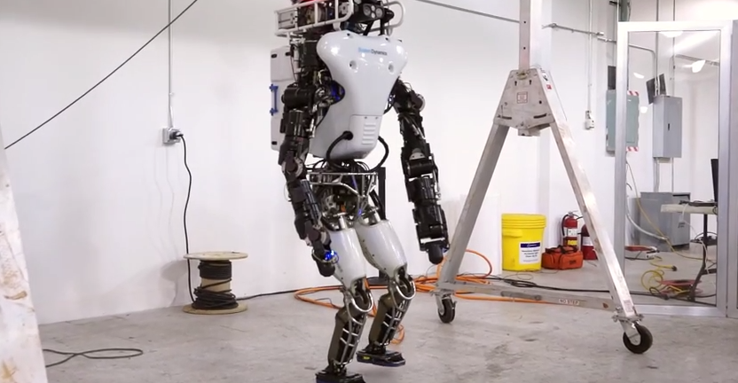
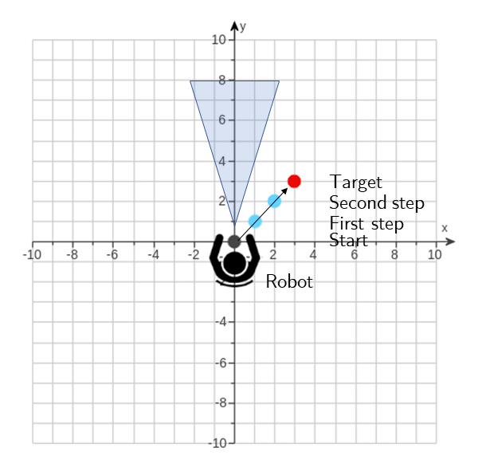

---
author:
- Martin Chapman
date: Wednesday 2nd February 2022
title: Software Sustainability - King's workshop exercises
---

# Prerequisites

The below material assumes that the software sustainability course has
been completed
(<https://www.youtube.com/playlist?list=PLxyHJ_wep1_DPbvtFl_-EGyoz2pVt-n1_>),
and that Python 3, nodejs, Git, Docker and Docker Compose are all
installed.

# Background

::: center
{height="5cm"}
:::

We are going to write a piece of code that simulates the movement of a
robot in a 2D space from its starting position to a goal position, which
is provided by a user.

The robot being modelled is intelligent enough to know the direction it
needs to move in to reach the target position, and this should be
captured in the code. For example, before each move the robot always
starts at position $(0, 0)$ (an X coordinate and a Y coordinate,
respectively) in the space, so if given a goal position of $(3, 3)$ it
knows it needs to increase both its x and y position until it arrives at
the desired position (i.e. walk diagonally forward).

Once the simulated robot has reached its target position, our code
should report how many steps it took the robot to get there. As such,
the simulation allows us to evaluate the robot's AI.

We should also be able to probe for the robot's position at any time.

## Example

1.  A user enters a goal position of $(3, 3)$. The robot is at position
    $(0, 0)$.

2.  The robot moves to position $(1, 1)$.

3.  The robot moves to position $(2, 2)$.

4.  The robot moves to position $(3, 3)$, which is the target position.

5.  It took the robot three steps to reach its target position, so this
    is reported back to the user.

::: center
{height="5cm"}
:::

# Session 1 (10.10 - 10.50) - Coding practice

Realise the simulation model described in Python code, adhering to the
principles of coding practice discussed in the course.

Your code should accept a target position as input, simulate the
movement of the robot towards that position, and report on the number of
steps it took the robot to reach it.

# Session 2 (11.00 - 11.50) - Version control

Make a version of your software, and push it to a remote repository on
King's Github ([github.kcl.ac.uk](https://github.kcl.ac.uk/)). Call this
repository '**robot**'.

You will need to log in with your k-number and password, if you have not
done so before.

*Public Github ([github.com](https://github.com)), should also work for
this task, but should only be used as a backup.*

Additional versions should be made at appropriate points while
completing the remaining tasks.

# Session 3 (12.00 - 12.50) - Testing

Write three tests to ensure the following:

1.  The robot can move three steps down (backwards).

2.  The robot can move a large amount to the left (e.g. 10,000 steps).

3.  The robot is **not** still at position 0, when asked to move to
    position $(3, 3)$.

Modify your program such that these tests pass, if needed.

You are welcome to add additional tests also.

# Session 4 (14.00 - 14.50) - Services

The supporting material for this session is available at
[github.com/martinteaching/sustainability](https://github.com/martinteaching/sustainability).

Wrap your Python robot simulation model in a server and run it.

Move the request for target position to a Javascript client, which, once
acquired, sends this information to the server, waits for the robot
simulation to complete, and then prints the number of steps for the
user.

# Session 5 (15.00 - 15.50) - Docker

Dockerise your program, using a Dockerfile and Docker compose, allowing
the Python server to run in a container, and the Javascript client to
issue requests to it.

# Additional Tasks

If you wish to expand on your solution, create a second Python service
that encapsulates the logic required to place $N$ objects randomly in a
2D space, each with a coordinate. Every time your robot moves, the
simulation code (contained in a service) should call this second service
to determine whether the robot has hit an object (i.e. the robot's
current coordinates are the same as the coordinates of one of the
objects). The total number of collisions should be recorded and reported
back to the user along with the total number of steps.

Under this setup, the client calls a service (robot), which in turn
calls a second service (object) as a part of its operation, and reports
the results back to the client.
