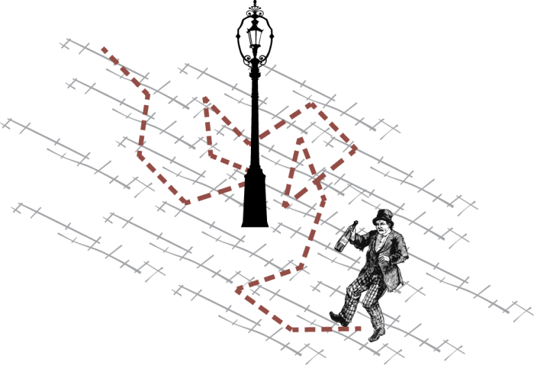
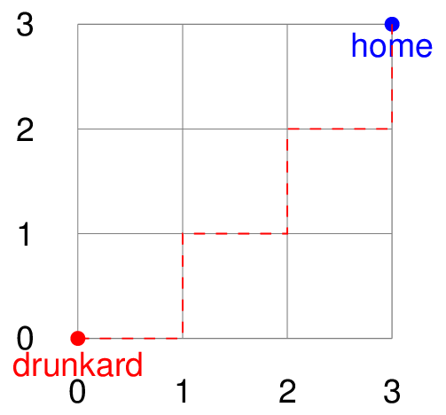

# Prerequisites

Please review the [workshop
prerequisites](https://github.com/martinteaching/sustainability/blob/master/workshops/kcl/2025/README.md).

# Background

Consider the [Drunkard’s
walk](https://en.wikipedia.org/wiki/Random_walk): starting at a pub
(represented by a point in a 2D space, the dimensions of which are a
variable), a drunkard stumbles around (moving either +1 or -1 on the X
or Y axis at random) until they reach home (represented by another point
in the 2D space). An example of a drunkard’s walk is shown below:

Here, the drunkard is at position $(0, 0)$. Home is at $(3, 3)$. The
path taken is: $(1, 0)$, $(1, 1)$, $(2, 1)$, $(2, 2)$, $(3, 2)$,
$(3, 3)$.

As in the example show, we always assume that the pub is at $(0, 0)$.
Similarly, we always assume that the drunkard’s home is at the maximum
point ($(3, 3)$, in this example). If the drunkard reaches the edge of
the space (top, right, bottom or left), further travel in that direction
is not permitted.

A piece of Python code simulating the drunkard’s walk is available
[here](https://github.com/martinteaching/sustainability/blob/master/workshops/kcl/2025/resources/drunkard.py).
It accepts the dimensions of the 2D space as input, simulates the
movement of the drunkard towards home, and reports on the path the
drunkard took to reach it. Thus, this code is a piece of research
software allowing us to explore the relationship between the size of 2D
spaces and the length of a drunkard’s walk.

# Session 1 (10.10 - 10.50) - Coding practice

Using [GitHub
Codespaces](https://github.com/martinteaching/sustainability/tree/master/workshops/kcl/2025#github-codespaces-recommended)
(or your local machine), refactor the [current Python
code](https://github.com/martinteaching/sustainability/blob/master/workshops/kcl/2025/resources/drunkard.py)
simulating the drunkard’s walk so that it adheres to the principles of
coding practice discussed in the course.

*You are welcome to reimplement the code using alternative logic first,
should you wish to.*

# Session 2 (11.00 - 11.50) - Version control

Make a version of your software, and push it to a remote repository on
King’s GitHub ([github.kcl.ac.uk](https://github.kcl.ac.uk/)). Call this
repository ‘drunkard’.

You will need to log in with your k-number and password, if you have not
done so before.

*Public Github ([github.com](https://github.com)), should also work for
this task, but should only be used as a backup.*

Additional versions should be made at appropriate points while
completing the remaining tasks.

# Session 3 (12.00 - 12.50) - Testing

Write three tests to ensure the following:

1.  The drunkard eventually reaches home.

2.  Even with a larger grid (10 by 10), the drunkard still eventually
    reaches home.

3.  The drunkard is **not** still at position 0, once they leave for
    home.

Modify your program such that these tests pass, if needed.

You are welcome to add additional tests also.

# Session 4 (14.00 - 14.50) - Services

The supporting materials for this session are available at
[github.com/martinteaching/sustainability/tree/master/resources](https://github.com/martinteaching/sustainability/tree/master/resources).

Wrap your Python drunkard simulation model in a server and run it.

Move the request for 2D space dimensions to a Javascript client, which,
once acquired, sends this information to the server, waits for the
drunkard simulation to complete, and then prints the path of the
drunkard for the user.

# Session 5 (15.00 - 15.50) - Docker

Dockerise your program—using a Dockerfile and Docker Compose—allowing
the Python server to run in a container, and the Javascript client to
issue requests to it.

# Additional Tasks

If you wish to expand on your solution, create a second Python service
that encapsulates the logic required to place $n$ rubbish bins randomly
in a 2D space, each with a coordinate. Every time your drunkard moves,
the simulation code (contained in a service) should call this second
service to determine whether the drunkard has hit a bin (i.e. the
drunkard’s current coordinates are the same as the coordinates of one of
the bins). The total number of collisions should be recorded and
reported back to the user along with the drunkard’s path.

Under this setup, the client calls a service (drunkard), which in turn
calls a second service (bins) as a part of its operation before
reporting the results back to the client.

# Assessment

Attendees at the workshop will be given time to review and start these
exercises individually, and will then be asked to complete them fully
with each other in an online collaborative environment.

Sufficient engagement with these collaborative sessions will result in a
‘pass’ mark for the workshop.
